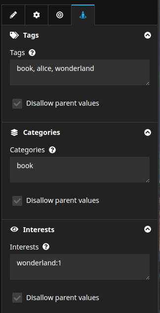
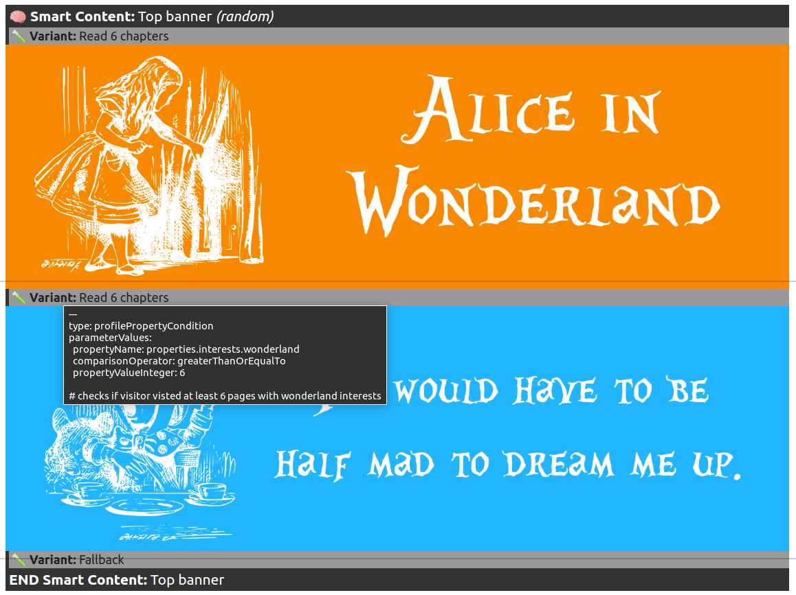

# Hb180.DXP.Unomi
> Apache Unomi PoC integration package.

### Authors & Sponsors

* Piotr Skwira - pskwira@180hb.com
* Szymon Gregorczyk - sgregorczyk@180hb.com

The development and the public-releases of this package is sponsored by:
* https://180hb.com/en/techlab.html

## About

The package provides simple integration with Apache Unomi CDP through implementation of Webtracker. It adds additional properties to every Document page which are injected into webtracker page data (tag, categories and interests). Those properties can be later used to personalize content as event.source or target properties.

There is a simple Content Element provided which helps with preparing personalized experience on Neos site. It's simply a container for different Variants of the content.

To get the better background understanding how it works please check following talk on Neoscon 2021:
https://www.neoscon.io/talks/neos-and-dxp-digital-experience-platform.html
(link to video will be provided when will be available)

## Installation

Hb180.DXP.Unomi is available via packagist. Run `composer require hb180/dxp-unomi

There is a content export from Neos.Demo site (7.0) in Resources/Private/Content folder. You can use it to recreate in Neos what was shown on PoC.
For example setup of Unomi please refer to Docs/requests folder.

## Unomi

To have a full experience you need to have Apache Unomi installed. 
The easiest way to do it, is to use Docker image apache/unomi (https://hub.docker.com/r/apache/unomi).

If you want to connect to it's console (inside Karaf) just use ssh while having image running:
    ssh karaf@127.0.0.1 -p 8102

## Note

This package is a PoC, which works really nice, but please be aware of that if you plan to use it on Production environment.
If you have any questions don't hesitate to ask on #slack (https://slack.neos.io/).
